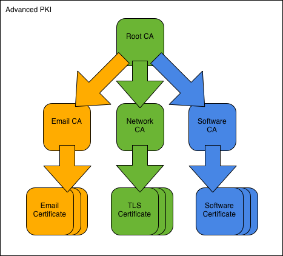

.. SSLCA documentation master file, created by
   sphinx-quickstart on Sat May 19 14:30:39 2012.
   You can adapt this file completely to your liking, but it should at least
   contain the root `toctree` directive.

.. highlight:: bash

==============================================================================
Advanced PKI
==============================================================================

The Advanced PKI consists of a root CA and a layer of subordinate CAs.

Overview
========

We assume a company named **Green AS**, controlling the domain green.no.
The company runs a three-pronged PKI to serve its security needs.

To implement the PKI, we first create the Green Root CA and its CA
certificate. We then use the root CA to create the three signing CAs:
Green Email CA, Green TLS CA, and Green Software CA.
The CAs in place we proceed to show them in operation, issuing user
certificates for email-protection, TLS-authentication, and code-signing
purposes respectively.

All commands are ready to be copy/pasted into a terminal session.
When you have reached the end of this page, you will have built
a PKI with multiple signing CAs and issued 4 different types of user
certificates.

To get started, fetch the Advanced PKI example files and change into the
new directory::

    git clone https://bitbucket.org/stefanholek/pki-example-2
    cd pki-example-2

Configuration Files
===================

We use one configuration file per CA:

.. toctree::
   :maxdepth: 2
   :titlesonly:

   root-ca.conf
   email-ca.conf
   tls-ca.conf
   software-ca.conf

And one configuration file per CSR type:

.. toctree::
   :maxdepth: 2
   :titlesonly:

   email.conf
   server.conf
   client.conf
   codesign.conf

Please study the configuration files before you continue.

1. Create Root CA
==================

1.1 Create directories
-----------------------
::

    mkdir -p ca/root-ca/private ca/root-ca/db crl certs
    chmod 700 ca/root-ca/private

The ``ca`` directory holds CA resources, the ``crl`` directory holds CRLs, and
the ``certs`` directory holds user certificates.
The directory layout stays the same throughout the tutorial.

1.2 Create database
--------------------
::

    cp /dev/null ca/root-ca/db/root-ca.db
    cp /dev/null ca/root-ca/db/root-ca.db.attr
    echo 01 > ca/root-ca/db/root-ca.crt.srl
    echo 01 > ca/root-ca/db/root-ca.crl.srl

The files must exist before the ``openssl ca`` command can be used.
Also see :doc:`../cadb`.

1.3 Create CA request
----------------------
::

    openssl req -new \
        -config etc/root-ca.conf \
        -out ca/root-ca.csr \
        -keyout ca/root-ca/private/root-ca.key

With the ``openssl req -new`` command we create a private key and a CSR for
the root CA.
The configuration is taken from the [req] section of the :doc:`root CA
configuration file<root-ca.conf>`.

1.4 Create CA certificate
--------------------------
::

    openssl ca -selfsign \
        -config etc/root-ca.conf \
        -in ca/root-ca.csr \
        -out ca/root-ca.crt \
        -extensions root_ca_ext \
        -enddate 20301231235959Z

With the ``openssl ca`` command we create a self-signed root
certificate from the CSR.
The configuration is taken from the [ca] section of the :doc:`root CA
configuration file<root-ca.conf>`.
Note that we specify an end date based on the key length.
2048-bit RSA keys are deemed safe until 2030 (`RSA Labs`_).

.. _`RSA Labs`: http://www.rsa.com/rsalabs/node.asp?id=2004

1.5 Create initial CRL
-----------------------
::

    openssl ca -gencrl \
        -config etc/root-ca.conf \
        -out crl/root-ca.crl

With the ``openssl ca -gencrl`` command we generate an initial (empty) CRL.

2. Create Email CA
===================

2.1 Create directories
-----------------------
::

    mkdir -p ca/email-ca/private ca/email-ca/db crl certs
    chmod 700 ca/email-ca/private

2.2 Create database
--------------------
::

    cp /dev/null ca/email-ca/db/email-ca.db
    cp /dev/null ca/email-ca/db/email-ca.db.attr
    echo 01 > ca/email-ca/db/email-ca.crt.srl
    echo 01 > ca/email-ca/db/email-ca.crl.srl

2.3 Create CA request
----------------------
::

    openssl req -new \
        -config etc/email-ca.conf \
        -out ca/email-ca.csr \
        -keyout ca/email-ca/private/email-ca.key

We create a private key and a CSR for the email CA.
The configuration is taken from the [req] section of the :doc:`email CA
configuration file<email-ca.conf>`.

2.4 Create CA certificate
--------------------------
::

    openssl ca \
        -config etc/root-ca.conf \
        -in ca/email-ca.csr \
        -out ca/email-ca.crt \
        -extensions signing_ca_ext

We use the root CA to issue the email CA certificate.
Points if you noticed that -extensions could have been omitted.

2.5 Create initial CRL
-----------------------
::

    openssl ca -gencrl \
        -config etc/email-ca.conf \
        -out crl/email-ca.crl

We create an initial, empty CRL.

2.6 Create PEM bundle
----------------------
::

    cat ca/email-ca.crt ca/root-ca.crt > \
        ca/email-ca-chain.pem

The "cert chain" PEM format is supported by most OpenSSL-based software
(e.g. Apache mod_ssl, stunnel).

3. Create TLS CA
=====================

3.1 Create directories
-----------------------
::

    mkdir -p ca/tls-ca/private ca/tls-ca/db crl certs
    chmod 700 ca/tls-ca/private

3.2 Create database
--------------------
::

    cp /dev/null ca/tls-ca/db/tls-ca.db
    cp /dev/null ca/tls-ca/db/tls-ca.db.attr
    echo 01 > ca/tls-ca/db/tls-ca.crt.srl
    echo 01 > ca/tls-ca/db/tls-ca.crl.srl

3.3 Create CA request
----------------------
::

    openssl req -new \
        -config etc/tls-ca.conf \
        -out ca/tls-ca.csr \
        -keyout ca/tls-ca/private/tls-ca.key

We create a private key and a CSR for the TLS CA.
The configuration is taken from the [req] section of the :doc:`TLS CA
configuration file<tls-ca.conf>`.

3.4 Create CA certificate
--------------------------
::

    openssl ca \
        -config etc/root-ca.conf \
        -in ca/tls-ca.csr \
        -out ca/tls-ca.crt \
        -extensions signing_ca_ext

We use the root CA to issue the TLS CA certificate.

3.5 Create initial CRL
-----------------------
::

    openssl ca -gencrl \
        -config etc/tls-ca.conf \
        -out crl/tls-ca.crl

We create an empty CRL.

3.6 Create PEM bundle
----------------------
::

    cat ca/tls-ca.crt ca/root-ca.crt > \
        ca/tls-ca-chain.pem

We create a certificate chain file.

4. Create Software CA
======================

4.1 Create directories
-----------------------
::

    mkdir -p ca/software-ca/private ca/software-ca/db crl certs
    chmod 700 ca/software-ca/private

4.2 Create database
--------------------
::

    cp /dev/null ca/software-ca/db/software-ca.db
    cp /dev/null ca/software-ca/db/software-ca.db.attr
    echo 01 > ca/software-ca/db/software-ca.crt.srl
    echo 01 > ca/software-ca/db/software-ca.crl.srl

4.3 Create CA request
----------------------
::

    openssl req -new \
        -config etc/software-ca.conf \
        -out ca/software-ca.csr \
        -keyout ca/software-ca/private/software-ca.key

We create a private key and a CSR for the software CA.
The configuration is taken from the [req] section of the :doc:`software CA
configuration file<software-ca.conf>`.

4.4 Create CA certificate
--------------------------
::

    openssl ca \
        -config etc/root-ca.conf \
        -in ca/software-ca.csr \
        -out ca/software-ca.crt \
        -extensions signing_ca_ext

We use the root CA to issue the software CA certificate.

4.5 Create initial CRL
-----------------------
::

    openssl ca -gencrl \
        -config etc/software-ca.conf \
        -out crl/software-ca.crl

We create an empty CRL.

4.6 Create PEM bundle
----------------------
::

    cat ca/software-ca.crt ca/root-ca.crt > \
        ca/software-ca-chain.pem

We create a certificate chain file.

5. Operate Email CA
====================

5.1 Create email request
-------------------------
::

    openssl req -new \
        -config etc/email.conf \
        -out certs/fred.csr \
        -keyout certs/fred.key

We create the private key and CSR for an email-protection certificate
using a :doc:`request configuration file<email.conf>`.
When prompted enter these DN components: C=NO, O=Green AS, CN=Fred
Flintstone, emailAddress=fred\@green.no. Leave other fields empty.

5.2 Create email certificate
-----------------------------
::

    openssl ca \
        -config etc/email-ca.conf \
        -in certs/fred.csr \
        -out certs/fred.crt \
        -extensions email_ext

We use the email CA to issue Fred's email-protection certificate.
A copy of the certificate is saved in the certificate archive under the name
``ca/email-ca/01.pem`` (01 being the certificate serial number in hex.)

5.3 Create PKCS#12 bundle
--------------------------
::

    openssl pkcs12 -export \
        -name "Fred Flintstone (Email Security)" \
        -caname "Green Email CA" \
        -caname "Green Root CA" \
        -inkey certs/fred.key \
        -in certs/fred.crt \
        -certfile ca/email-ca-chain.pem \
        -out certs/fred.p12

We pack the private key, the certificate, and the CA chain into a PKCS#12
bundle. This format (often with a .pfx extension) is used to distribute keys
and certificates to end users.
The friendly names help identify individual certificates within the bundle.

5.4 Revoke certificate
-----------------------
::

    openssl ca \
        -config etc/email-ca.conf \
        -revoke ca/email-ca/01.pem \
        -crl_reason keyCompromise

When Fred's laptop goes missing, we revoke his certificate.

5.5 Create CRL
---------------
::

    openssl ca -gencrl \
        -config etc/email-ca.conf \
        -out crl/email-ca.crl

The next CRL contains the revoked certificate.

6. Operate TLS CA
======================

6.1 Create TLS server request
-----------------------------
::

    SAN=DNS:green.no,DNS:www.green.no \
    openssl req -new \
        -config etc/server.conf \
        -out certs/green.no.csr \
        -keyout certs/green.no.key

We create the private key and CSR for a TLS-server certificate
using the appropriate :doc:`request configuration file<server.conf>`.
When prompted enter these DN components: C=NO, O=Green AS, CN=www.green.no.
The subjectAltName cannot be prompted for and must be specified as environment
variable.

6.2 Create TLS server certificate
---------------------------------
::

    openssl ca \
        -config etc/tls-ca.conf \
        -in certs/green.no.csr \
        -out certs/green.no.crt \
        -extensions server_ext

We use the TLS CA to issue the server certificate.

6.3 Create PKCS#12 bundle
--------------------------
::

    openssl pkcs12 -export \
        -name "green.no (Network Component)" \
        -caname "Green TLS CA" \
        -caname "Green Root CA" \
        -inkey certs/green.no.key \
        -in certs/green.no.crt \
        -certfile ca/tls-ca-chain.pem \
        -out certs/green.no.p12

We pack the private key, the certificate, and the CA chain into a PKCS#12
bundle for distribution.

6.4 Create TLS client request
-----------------------------
::

    openssl req -new \
        -config etc/client.conf \
        -out certs/barney.csr \
        -keyout certs/barney.key

We create the private key and CSR for a TLS-client certificate
using the :doc:`client request configuration file<client.conf>`.
When prompted enter these DN components: C=NO, O=Telenor AS, OU=Support,
CN=Barney Rubble, emailAddress=barney\@telenor.no.

6.5 Create TLS client certificate
---------------------------------
::

    openssl ca \
        -config etc/tls-ca.conf \
        -in certs/barney.csr \
        -out certs/barney.crt \
        -policy extern_pol \
        -extensions client_ext

We use the TLS CA to issue Barney's client certificate. Note that we must
specify the 'extern' naming policy because the DN would not satisfy the
default 'match' policy.

6.6 Create PKCS#12 bundle
--------------------------
::

    openssl pkcs12 -export \
        -name "Barney Rubble (Network Access)" \
        -caname "Green TLS CA" \
        -caname "Green Root CA" \
        -inkey certs/barney.key \
        -in certs/barney.crt \
        -certfile ca/tls-ca-chain.pem \
        -out certs/barney.p12

We pack everything up into a PKCS#12 bundle for distribution.

6.7 Revoke certificate
-----------------------
::

    openssl ca \
        -config etc/tls-ca.conf \
        -revoke ca/tls-ca/02.pem \
        -crl_reason affiliationChanged

When the support contract ends, we revoke the certificate.

6.8 Create CRL
---------------
::

    openssl ca -gencrl \
        -config etc/tls-ca.conf \
        -out crl/tls-ca.crl

The next CRL contains the revoked certificate.

7. Operate Software CA
=======================

7.1 Create code-signing request
--------------------------------
::

    openssl req -new \
        -config etc/codesign.conf \
        -out certs/software.csr \
        -keyout certs/software.key \
        -nodes

We create the private key and CSR for a code-signing certificate
using another :doc:`request configuration file<codesign.conf>`.
When prompted enter these DN components: C=NO, O=Green AS, OU=Green
Certificate Authority, CN=Green Software Certificate.

7.2 Create code-signing certificate
------------------------------------
::

    openssl ca \
        -config etc/software-ca.conf \
        -in certs/software.csr \
        -out certs/software.crt \
        -extensions codesign_ext

We use the software CA to issue the code-signing certificate.

7.3 Create PKCS#12 bundle
--------------------------
::

    openssl pkcs12 -export \
        -name "Green Software Certificate" \
        -caname "Green Software CA" \
        -caname "Green Root CA" \
        -inkey certs/software.key \
        -in certs/software.crt \
        -certfile ca/software-ca-chain.pem \
        -out certs/software.p12

We pack everything up into a PKCS#12 bundle for distribution.

7.4 Revoke certificate
-----------------------
::

    openssl ca \
        -config etc/software-ca.conf \
        -revoke ca/software-ca/01.pem \
        -crl_reason unspecified

To complete the example, we revoke the software certificate.

7.5 Create CRL
---------------
::

    openssl ca -gencrl \
        -config etc/software-ca.conf \
        -out crl/software-ca.crl

The next CRL contains the revoked certificate.

8. Publish Certificates
========================

8.1 Create DER certificate
---------------------------
::

    openssl x509 \
        -in ca/root-ca.crt \
        -out ca/root-ca.cer \
        -outform der

All published certificates must be in DER format.
MIME type: application/pkix-cert.
[:rfc:`2585#section-4.1`]

8.2 Create DER CRL
-------------------
::

    openssl crl \
        -in crl/email-ca.crl \
        -out crl/email-ca.crl \
        -outform der

All published CRLs must be in DER format.
MIME type: application/pkix-crl.
[:rfc:`2585#section-4.2`]

8.3 Create PKCS#7 bundle
-------------------------
::

    openssl crl2pkcs7 -nocrl \
        -certfile ca/tls-ca-chain.pem \
        -out ca/tls-ca-chain.p7c \
        -outform der

PKCS#7 is used to bundle two or more certificates.
MIME type: application/pkcs7-mime.
[:rfc:`5273#page-3`]

References
======================

* http://www.openssl.org/docs/apps/req.html
* http://www.openssl.org/docs/apps/ca.html
* http://www.openssl.org/docs/apps/x509.html
* http://www.openssl.org/docs/apps/crl.html
* http://www.openssl.org/docs/apps/crl2pkcs7.html
* http://www.openssl.org/docs/apps/pkcs7.html
* http://www.openssl.org/docs/apps/pkcs12.html

