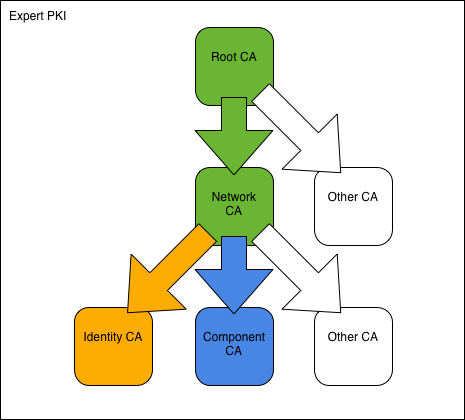

.. SSLCA documentation master file, created by
   sphinx-quickstart on Sat May 19 14:30:39 2012.
   You can adapt this file completely to your liking, but it should at least
   contain the root `toctree` directive.

.. highlight:: bash

==============================================================================
Expert PKI
==============================================================================

The Expert PKI consist of a root CA, an intermediate CA, and two signing CAs.

Overview
========

We assume a company named **Blue AB**, controlling the domain blue.se.
The company operates a flexible, multi-level PKI.

To construct the PKI, we
start with the Blue Root CA followed by the intermediate Blue Network CA.
We then use the Network CA to create the two signing CAs: Blue Identity CA and
Blue Component CA.
With the CAs in place, we proceed to issue certificates to users and network
components respectively.

All commands are ready to be copy/pasted into a terminal session.
When you have reached the end of this page, you will have built
a PKI with both intermediate and signing CAs and issued all major types of
user certificates.

To get started, fetch the Expert PKI example files and change into the new
directory::

    git clone https://bitbucket.org/stefanholek/pki-example-3
    cd pki-example-3

Configuration Files
===================

We use one configuration file per CA:

.. toctree::
   :maxdepth: 1
   :titlesonly:

   root-ca.conf
   network-ca.conf
   identity-ca.conf
   component-ca.conf

And one configuration file per CSR type:

.. toctree::
   :maxdepth: 1
   :titlesonly:

   identity.conf
   encryption.conf
   server.conf
   client.conf
   timestamp.conf
   ocspsign.conf

Please study the configuration files before you continue.

1. Create Root CA
=======================

1.1 Create directories
-----------------------
::

    mkdir -p ca/root-ca/private ca/root-ca/db crl certs
    chmod 700 ca/root-ca/private

1.2 Create database
--------------------
::

    cp /dev/null ca/root-ca/db/root-ca.db
    cp /dev/null ca/root-ca/db/root-ca.db.attr
    echo 01 > ca/root-ca/db/root-ca.crt.srl
    echo 01 > ca/root-ca/db/root-ca.crl.srl

1.3 Create CA request
----------------------
::

    openssl req -new \
        -config etc/root-ca.conf \
        -out ca/root-ca.csr \
        -keyout ca/root-ca/private/root-ca.key

1.4 Create CA certificate
--------------------------
::

    openssl ca -selfsign \
        -config etc/root-ca.conf \
        -in ca/root-ca.csr \
        -out ca/root-ca.crt \
        -extensions root_ca_ext \
        -enddate 20301231235959Z

2048-bit RSA keys are deemed safe until 2030 (`RSA Labs`_).

.. _`RSA Labs`: http://www.rsa.com/rsalabs/node.asp?id=2004

1.5 Create initial CRL
-----------------------
::

    openssl ca -gencrl \
        -config etc/root-ca.conf \
        -out crl/root-ca.crl

2. Create Network CA
==========================

2.1 Create directories
-----------------------
::

    mkdir -p ca/network-ca/private ca/network-ca/db crl certs
    chmod 700 ca/network-ca/private

2.2 Create database
--------------------
::

    cp /dev/null ca/network-ca/db/network-ca.db
    cp /dev/null ca/network-ca/db/network-ca.db.attr
    echo 01 > ca/network-ca/db/network-ca.crt.srl
    echo 01 > ca/network-ca/db/network-ca.crl.srl

2.3 Create CA request
----------------------
::

    openssl req -new \
        -config etc/network-ca.conf \
        -out ca/network-ca.csr \
        -keyout ca/network-ca/private/network-ca.key

2.4 Create CA certificate
--------------------------
::

    openssl ca \
        -config etc/root-ca.conf \
        -in ca/network-ca.csr \
        -out ca/network-ca.crt \
        -extensions intermediate_ca_ext \
        -enddate 20301231235959Z

Intermediate CAs should have the same life span as their root CAs.

2.5 Create initial CRL
-----------------------
::

    openssl ca -gencrl \
        -config etc/network-ca.conf \
        -out crl/network-ca.crl

2.6 Create PEM bundle
----------------------
::

    cat ca/network-ca.crt ca/root-ca.crt > \
        ca/network-ca-chain.pem

3. Create Identity CA
===========================

3.1 Create directories
-----------------------
::

    mkdir -p ca/identity-ca/private ca/identity-ca/db crl certs
    chmod 700 ca/identity-ca/private

3.2 Create database
--------------------
::

    cp /dev/null ca/identity-ca/db/identity-ca.db
    cp /dev/null ca/identity-ca/db/identity-ca.db.attr
    echo 01 > ca/identity-ca/db/identity-ca.crt.srl
    echo 01 > ca/identity-ca/db/identity-ca.crl.srl

3.3 Create CA request
----------------------
::

    openssl req -new \
        -config etc/identity-ca.conf \
        -out ca/identity-ca.csr \
        -keyout ca/identity-ca/private/identity-ca.key

3.4 Create CA certificate
--------------------------
::

    openssl ca \
        -config etc/network-ca.conf \
        -in ca/identity-ca.csr \
        -out ca/identity-ca.crt \
        -extensions signing_ca_ext

3.5 Create initial CRL
-----------------------
::

    openssl ca -gencrl \
        -config etc/identity-ca.conf \
        -out crl/identity-ca.crl

3.6 Create PEM bundle
----------------------
::

    cat ca/identity-ca.crt ca/network-ca-chain.pem > \
        ca/identity-ca-chain.pem

4. Create Component CA
============================

4.1 Create directories
-----------------------
::

    mkdir -p ca/component-ca/private ca/component-ca/db crl certs
    chmod 700 ca/component-ca/private

4.2 Create database
--------------------
::

    cp /dev/null ca/component-ca/db/component-ca.db
    cp /dev/null ca/component-ca/db/component-ca.db.attr
    echo 01 > ca/component-ca/db/component-ca.crt.srl
    echo 01 > ca/component-ca/db/component-ca.crl.srl

4.3 Create CA request
----------------------
::

    openssl req -new \
        -config etc/component-ca.conf \
        -out ca/component-ca.csr \
        -keyout ca/component-ca/private/component-ca.key

4.4 Create CA certificate
--------------------------
::

    openssl ca \
        -config etc/network-ca.conf \
        -in ca/component-ca.csr \
        -out ca/component-ca.crt \
        -extensions signing_ca_ext

4.5 Create initial CRL
-----------------------
::

    openssl ca -gencrl \
        -config etc/component-ca.conf \
        -out crl/component-ca.crl

4.6 Create PEM bundle
----------------------
::

    cat ca/component-ca.crt ca/network-ca-chain.pem > \
        ca/component-ca-chain.pem

5. Operate Identity CA
============================

5.1 Create identity request
----------------------------
::

    openssl req -new \
        -config etc/identity.conf \
        -out certs/fred-id.csr \
        -keyout certs/fred-id.key

DN: C=SE, O=Blue AB, CN=Fred Flintstone, emailAddress=fred\@blue.se

5.2 Create identity certificate
--------------------------------
::

    openssl ca \
        -config etc/identity-ca.conf \
        -in certs/fred-id.csr \
        -out certs/fred-id.crt \
        -extensions identity_ext

5.3 Create PKCS#12 bundle
--------------------------
::

    openssl pkcs12 -export \
        -name "Fred Flintstone (Blue Identity)" \
        -caname "Blue Identity CA" \
        -caname "Blue Network CA" \
        -caname "Blue Root CA" \
        -inkey certs/fred-id.key \
        -in certs/fred-id.crt \
        -certfile ca/identity-ca-chain.pem \
        -out certs/fred-id.p12

5.4 Create encryption request
------------------------------
::

    openssl req -new \
        -config etc/encryption.conf \
        -out certs/fred-enc.csr \
        -keyout certs/fred-enc.key

DN: C=SE, O=Blue AB, CN=Fred Flintstone, emailAddress=fred\@blue.se

5.5 Create encryption certificate
----------------------------------
::

    openssl ca \
        -config etc/identity-ca.conf \
        -in certs/fred-enc.csr \
        -out certs/fred-enc.crt \
        -extensions encryption_ext

5.6 Create PKCS#12 bundle
--------------------------
::

    openssl pkcs12 -export \
        -name "Fred Flintstone (Blue Encryption)" \
        -caname "Blue Identity CA" \
        -caname "Blue Network CA" \
        -caname "Blue Root CA" \
        -inkey certs/fred-enc.key \
        -in certs/fred-enc.crt \
        -certfile ca/identity-ca-chain.pem \
        -out certs/fred-enc.p12

5.7 Revoke certificate
-----------------------
::

    openssl ca \
        -config etc/identity-ca.conf \
        -revoke ca/identity-ca/02.pem \
        -crl_reason superseded

5.8 Create CRL
---------------
::

    openssl ca -gencrl \
        -config etc/identity-ca.conf \
        -out crl/identity-ca.crl

6. Operate Component CA
============================

6.1 Create TLS server request
-----------------------------
::

    SAN=DNS:blue.se,DNS:www.blue.se \
    openssl req -new \
        -config etc/server.conf \
        -out certs/blue.se.csr \
        -keyout certs/blue.se.key

DN: C=SE, O=Blue AB, CN=www.blue.se

6.2 Create TLS server certificate
---------------------------------
::

    openssl ca \
        -config etc/component-ca.conf \
        -in certs/blue.se.csr \
        -out certs/blue.se.crt \
        -extensions server_ext

6.3 Create TLS client request
-----------------------------
::

    openssl req -new \
        -config etc/client.conf \
        -out certs/net-mon.csr \
        -keyout certs/net-mon.key

DN: C=SE, O=Blue AB, CN=Blue Network Monitoring

6.4 Create TLS client certificate
---------------------------------
::

    openssl ca \
        -config etc/component-ca.conf \
        -in certs/net-mon.csr \
        -out certs/net-mon.crt \
        -extensions client_ext

6.5 Create time-stamping request
---------------------------------
::

    openssl req -new \
        -config etc/timestamp.conf \
        -out certs/tsa.csr \
        -keyout certs/tsa.key

DN: C=SE, O=Blue AB, OU=Blue TSA, CN=Blue TSA

6.6 Create time-stamping certificate
-------------------------------------
::

    openssl ca \
        -config etc/component-ca.conf \
        -in certs/tsa.csr \
        -out certs/tsa.crt \
        -extensions timestamp_ext \
        -days 1826

6.7 Create OCSP-signing request
--------------------------------
::

    openssl req -new \
        -config etc/ocspsign.conf \
        -out certs/ocsp.csr \
        -keyout certs/ocsp.key

DN: C=SE, O=Blue AB, CN=Blue OCSP Responder

6.8 Create OCSP-signing certificate
------------------------------------
::

    openssl ca \
        -config etc/component-ca.conf \
        -in certs/ocsp.csr \
        -out certs/ocsp.crt \
        -extensions ocspsign_ext \
        -days 14

6.9 Revoke certificate
-----------------------
::

    openssl ca \
        -config etc/component-ca.conf \
        -revoke ca/component-ca/02.pem \
        -crl_reason superseded

6.10 Create CRL
----------------
::

    openssl ca -gencrl \
        -config etc/component-ca.conf \
        -out crl/component-ca.crl

7. Publish Certificates
========================

7.1 Create DER certificate
---------------------------
::

    openssl x509 \
        -in ca/root-ca.crt \
        -out ca/root-ca.cer \
        -outform der

All published certificates must be in DER format.
MIME type: application/pkix-cert.
[:rfc:`2585#section-4.1`]

7.2 Create DER CRL
-------------------
::

    openssl crl \
        -in crl/network-ca.crl \
        -out crl/network-ca.crl \
        -outform der

All published CRLs must be in DER format.
MIME type: application/pkix-crl.
[:rfc:`2585#section-4.2`]

7.3 Create PKCS#7 bundle
-------------------------
::

    openssl crl2pkcs7 -nocrl \
        -certfile ca/identity-ca-chain.pem \
        -out ca/identity-ca-chain.p7c \
        -outform der

PKCS#7 is used to bundle two or more certificates.
MIME type: application/pkcs7-mime.
[:rfc:`5273#page-3`]

References
======================

* http://www.openssl.org/docs/apps/req.html
* http://www.openssl.org/docs/apps/ca.html
* http://www.openssl.org/docs/apps/x509.html
* http://www.openssl.org/docs/apps/crl.html
* http://www.openssl.org/docs/apps/crl2pkcs7.html
* http://www.openssl.org/docs/apps/pkcs7.html
* http://www.openssl.org/docs/apps/pkcs12.html

