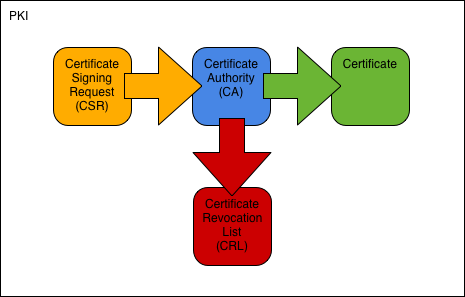

.. SSLCA documentation master file, created by
   sphinx-quickstart on Sat May 19 14:30:39 2012.
   You can adapt this file completely to your liking, but it should at least
   contain the root `toctree` directive.

.. highlight:: none

==============================================================================
OpenSSL PKI Tutorial |version|
==============================================================================

Create and operate Public Key Infrastructures with OpenSSL.

Overview
============

This tutorial shows how to implement real-world
PKIs with the OpenSSL toolkit.

In the first part of the tutorial we introduce the necessary terms and concepts.
The second part consists of examples, where we build increasingly more
sophisticated PKIs using nothing but the ``openssl`` utility.
The tutorial puts a special focus on configuration files, which are key
to taming the ``openssl`` command line. It also serves to promote what we have
found to be the most effective way of partinioning the configuration space:

* One configuration file per CA, and
* One configuration file per CSR type.

Please study the configuration files included in the examples, it's where most
of the treasure is buried.

PKI Concepts
================

At its heart, an X.509 PKI is a security architecture that uses well-established
cryptographic mechanisms to support use-cases like email protection and web
server authentication. In this regard it is similar
to other systems based on public-key cryptography, for example OpenPGP [:rfc:`4880`].
In the realm of X.509 however, and thanks to its roots in a globe-spanning
scheme devised by the telecom industry, these mechanisms come with a fair
amount of administrative overhead.

One thing to keep in mind is that X.509 is not an application,
but a specification of upon which applications like
Secure Multipurpose Internet Mail Extensions (S/MIME) and
Transport Layer Security (TLS) are based.
The provided building blocks are very generic and derive most of
their meaning from the relations that exist/are established between them.
It's called an infrastructure for a reason.

Process
----------

#. A requestor generates a CSR and submits it to the CA.
#. The CA issues a certificate based on the CSR and returns it to the requestor.
#. Should the certificate at some point be revoked, the CA adds it to its CRL.

Terms
------------

Public Key Infrastructure (PKI)
    Security architecture where trust is conveyed through the signature
    of a trusted CA.

Certificate Authority (CA)
    Entity issuing certificates and CRLs.

Registration Authority (RA)
    Entity handling PKI enrollment. May be identical with the CA.

Certificate
    Public key and ID bound by a CA signature.

Certificate Signing Request (CSR)
    Request for certification. Contains public key and ID to be certified.

Certificate Revocation List (CRL)
    List of revoked certificates. Issued by a CA at regular intervals.

Certification Practice Statement (CPS)
    Document describing structure and processes of a CA.

Certificates
-----------------

CA Certificate
    Certificate of a CA. Used to sign certificates and CRLs.

Root Certificate
    Self-signed CA certificate at the root of a PKI hierarchy.
    Serves as the PKI's trust anchor.

Cross Certificate
    CA certificate issued by a CA external to the primary PKI hierarchy.
    Used to connect two PKIs and thus usually comes in pairs. [#]_

User Certificate
    End-user certificate issued for one or more purposes:
    email-protection, server-auth, client-auth, code-signing, etc.
    A user certificate cannot sign other certificates.

.. rubric:: Footnotes

.. [#] The RFC classifies any CA-signs-CA scenario as cross-certification, to
       distinguish it from self-issuing.
       Outside of specs however, the term normally only refers to inter-PKI
       cross-certification.

File Formats
------------

Privacy Enhanced Mail (PEM)
    Text format. Base-64 encoded data with header and footer lines.
    Preferred format in OpenSSL and most software based on it (e.g. Apache
    mod_ssl, stunnel).

Distinguished Encoding Rules (DER)
    Binary format. Preferred format in Windows environments. Also the
    official format for Internet download of certificates and CRLs.

Examples
================

The examples are meant to be done in order, each providing the basis for
the ones that follow.
They are deliberately low on prose, we prefer to let the configuration files
and command lines speak for themselves.
Please use the links at the bottom of each page for background information.

Note: You need at least OpenSSL 1.0.1. Check with::

    openssl version

Simple PKI
--------------

In this example we create the simplest possible PKI: One root CA and one
signing CA.
We use the CA to issue two types of user certificates.

.. toctree::
   :maxdepth: 1
   :titlesonly:

   simple/index

Advanced PKI
----------------

In this example we create a larger setup, consisting of a root CA and three
signing CAs.
We use the CAs to issue 4 different types of user certificates.
We also encounter more certificate extensions.

.. toctree::
   :maxdepth: 1
   :titlesonly:

   advanced/index

Expert PKI
--------------

In this example we create a 3-tier CA hierarchy: One root CA, one intermediate
CA, and two signing CAs.
We use the CAs to issue 6 types of user certificates.
We revisit the certificatePolicies extension and define custom policy OIDs.
We also show how to configure an OCSP responder.

:doc:`expert/index`

Appendixes
==========

MIME Types
----------------------

This section takes a closer look at the MIME types and file extensions
used.

.. toctree::
   :maxdepth: 1
   :titlesonly:

   mime

CA Database
-----------------------

This section examines the format of the CA database.

.. toctree::
   :maxdepth: 1
   :titlesonly:

   cadb

References
==========

:rfc:`5280`
    Internet X.509 Public Key Infrastructure Certificate
    and Certificate Revocation List (CRL) Profile

:rfc:`2585`
    Internet X.509 Public Key Infrastructure
    Operational Protocols: FTP and HTTP

:rfc:`5750`
    Secure/Multipurpose Internet Mail Extensions (S/MIME) Version 3.2
    Certificate Handling

:rfc:`6125`
    Representation and Verification of Domain-Based Application Service
    Identity within Internet Public Key Infrastructure Using X.509 (PKIX)
    Certificates in the Context of Transport Layer Security (TLS)

`Baseline Requirements <https://www.cabforum.org/Baseline_Requirements_V1.pdf>`_ [pdf, opens in browser]
    CA/Browser Forum Baseline Requirements for the Issuance and Management
    of Publicly-Trusted Certificates

`X.509 Recommendation <http://www.itu.int/rec/dologin_pub.asp?lang=e&id=T-REC-X.509-200811-I!!PDF-E&type=items>`_ [pdf, direct download]
    ITU-T X.509 Public-Key and Attribute Certificate Frameworks Recommendation

`OpenSSL TEST CA <http://www.carillon.ca/library/data/openssl_testca_howto_1.3.pdf>`_ [pdf, direct download]
    Carillon Information Security: How to Set Up an OpenSSL TEST CA for
    Interoperability Testing with CertiPath

