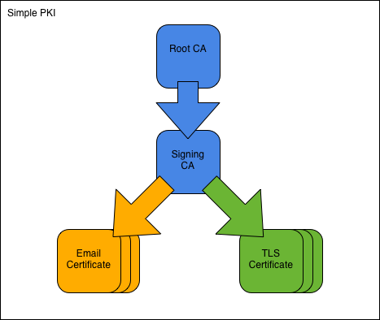

.. SSLCA documentation master file, created by
   sphinx-quickstart on Sat May 19 14:30:39 2012.
   You can adapt this file completely to your liking, but it should at least
   contain the root `toctree` directive.

.. highlight:: bash

Simple PKI
==============================================================================

The Simple PKI consists of one root CA and one signing CA.

Overview
========

We assume an organisation named **Simple Inc**, controlling the domain
simple.org.

First, we create the Simple Root CA and its CA certificate.
We then use the root CA to create the Simple Signing CA.
Once the CAs are in place we issue an email-protection certificate
to employee Fred Flintstone, and a TLS-server certificate to the webserver at
www.simple.org.
Finally, we look at the output formats the CA needs to support and show
how to view the contents of files we have created.

All commands are ready to be copy/pasted into a terminal session.
When you have reached the end of this page, you will have performed
all operations you are likely to encounter in a PKI.

To get started, fetch the Simple PKI example files and change into the
new directory::

    git clone https://bitbucket.org/stefanholek/pki-example-1
    cd pki-example-1

Layout
=============

We use one configuration file per CA:

* :doc:`root-ca.conf`
* :doc:`signing-ca.conf`

And one configuration file per CSR type:

* :doc:`email-client.conf`
* :doc:`tls-server.conf`

Please study the configuration files before you continue.

.. toctree::
   :hidden:

   root-ca.conf
   signing-ca.conf
   email-client.conf
   tls-server.conf

\1. Create Root CA
==================

\1.1 Create directories
------------------------
::

    mkdir -p ca/root-ca/private ca/root-ca/db crl certs
    chmod 700 ca/root-ca/private

\1.2 Create database
---------------------
::

    cp /dev/null ca/root-ca/db/root-ca.db
    cp /dev/null ca/root-ca/db/root-ca.db.attr
    echo 01 > ca/root-ca/db/root-ca.crt.srl
    echo 01 > ca/root-ca/db/root-ca.crl.srl

\1.3 Create CA request
-----------------------
::

    openssl req -new \
        -config etc/root-ca.conf \
        -out ca/root-ca.csr \
        -keyout ca/root-ca/private/root-ca.key

The ``openssl req`` command takes its configuration from the [req] section of the
:doc:`configuration file <root-ca.conf>`.

\1.4 Create CA certificate
---------------------------
::

    openssl ca -selfsign \
        -config etc/root-ca.conf \
        -in ca/root-ca.csr \
        -out ca/root-ca.crt \
        -extensions root_ca_ext

The ``openssl ca`` command takes its configuration from the [ca] section of the
:doc:`configuration file <root-ca.conf>`.

\2. Create Signing CA
=====================

\2.1 Create directories
------------------------
::

    mkdir -p ca/signing-ca/private ca/signing-ca/db crl certs
    chmod 700 ca/signing-ca/private

\2.2 Create database
---------------------
::

    cp /dev/null ca/signing-ca/db/signing-ca.db
    cp /dev/null ca/signing-ca/db/signing-ca.db.attr
    echo 01 > ca/signing-ca/db/signing-ca.crt.srl
    echo 01 > ca/signing-ca/db/signing-ca.crl.srl

\2.3 Create CA request
-----------------------
::

    openssl req -new \
        -config etc/signing-ca.conf \
        -out ca/signing-ca.csr \
        -keyout ca/signing-ca/private/signing-ca.key

\2.4 Create CA certificate
---------------------------
::

    openssl ca \
        -config etc/root-ca.conf \
        -in ca/signing-ca.csr \
        -out ca/signing-ca.crt \
        -extensions signing_ca_ext

\3. Operate Signing CA
======================

\3.1 Create email request
--------------------------
::

    openssl req -new \
        -config etc/email-client.conf \
        -out certs/fred.csr \
        -keyout certs/fred.key

When prompted enter these DN components:
DC=org, DC=simple, O=Simple Inc, CN=Fred Flintstone,
emailAddress=fred\@simple.org. Leave other fields blank.

\3.2 Create email certificate
------------------------------
::

    openssl ca \
        -config etc/signing-ca.conf \
        -in certs/fred.csr \
        -out certs/fred.crt \
        -extensions email_ext

\3.3 Create server request
---------------------------
::

    SAN=DNS:www.simple.org \
    openssl req -new \
        -config etc/tls-server.conf \
        -out certs/simple.org.csr \
        -keyout certs/simple.org.key \
        -nodes

When prompted enter these DN components:
DC=org, DC=simple, O=Simple Inc, CN=www.simple.org.
Note that the subjectAltName must be specified as environment variable.

\3.4 Create server certificate
-------------------------------
::

    openssl ca \
        -config etc/signing-ca.conf \
        -in certs/simple.org.csr \
        -out certs/simple.org.crt \
        -extensions server_ext

\3.5 Revoke certificate
------------------------
::

    openssl ca \
        -config etc/signing-ca.conf \
        -revoke ca/signing-ca/02.pem \
        -crl_reason superseded

Revokes the certificate with serial number 02 (hex).

\3.6 Create CRL
----------------
::

    openssl ca -gencrl \
        -config etc/signing-ca.conf \
        -out crl/signing-ca.crl

\4. Output Formats
===================

\4.1 Create DER certificate
----------------------------
::

    openssl x509 \
        -in certs/fred.crt \
        -out certs/fred.cer \
        -outform der

All published certificates must be in DER format.

\4.2 Create DER CRL
--------------------
::

    openssl crl \
        -in crl/signing-ca.crl \
        -out crl/signing-ca.crl \
        -outform der

All published CRLs must be in DER format.

\4.3 Create PKCS#7 bundle
--------------------------
::

    openssl crl2pkcs7 -nocrl \
        -certfile ca/signing-ca.crt \
        -certfile ca/root-ca.crt \
        -out certs/signing-ca-chain.p7c \
        -outform der

PKCS#7 is used to bundle two or more certificates. The format would
also allow for CRLs but they are not used in practice.

\4.4 Create PKCS#12 bundle
---------------------------
::

    openssl pkcs12 -export \
        -name "Fred Flintstone" \
        -inkey certs/fred.key \
        -in certs/fred.crt \
        -out certs/fred.p12

PKCS#12 is used to bundle a certificate and its private key.
Additional certificates may be added, typically the certificates comprising
the chain up to the Root CA.

\4.5 Create PEM bundle
-----------------------
::

    cat ca/signing-ca.crt ca/root-ca.crt > \
        ca/signing-ca-chain.pem

    cat certs/fred.key certs/fred.crt > \
        certs/fred.pem

PEM bundles are created by concatenating other PEM-formatted files. Both
"cert chain" and "key + cert" versions are in use.

5. View Results
================

\5.1 View request
------------------
::

    openssl req \
        -in certs/fred.csr \
        -noout \
        -text

\5.2 View certificate
----------------------
::

    openssl x509 \
        -in certs/fred.crt \
        -noout \
        -text

\5.3 View CRL
--------------
::

    openssl crl \
        -in crl/signing-ca.crl \
        -inform der \
        -noout \
        -text

\5.4 View PKCS#7 bundle
------------------------
::

    openssl pkcs7 \
        -in ca/signing-ca-chain.p7c \
        -inform der \
        -noout \
        -text \
        -print_certs

\5.5 View PKCS#12 bundle
-------------------------
::

    openssl pkcs12 \
        -in certs/fred.p12 \
        -nodes \
        -info

References
======================

* http://openssl.org/docs/apps/req.html
* http://openssl.org/docs/apps/ca.html
* http://openssl.org/docs/apps/x509.html
* http://openssl.org/docs/apps/crl.html
* http://openssl.org/docs/apps/crl2pkcs7.html
* http://openssl.org/docs/apps/pkcs7.html
* http://openssl.org/docs/apps/pkcs12.html

